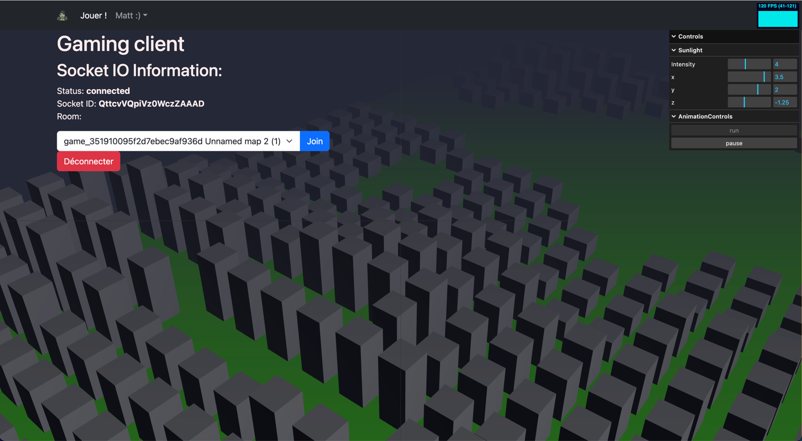
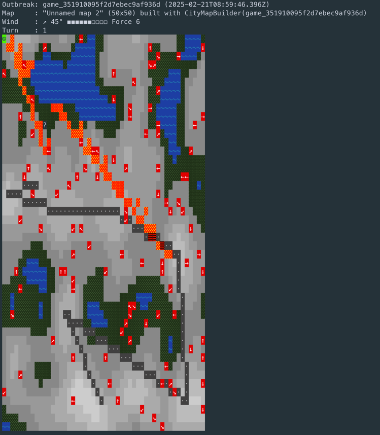
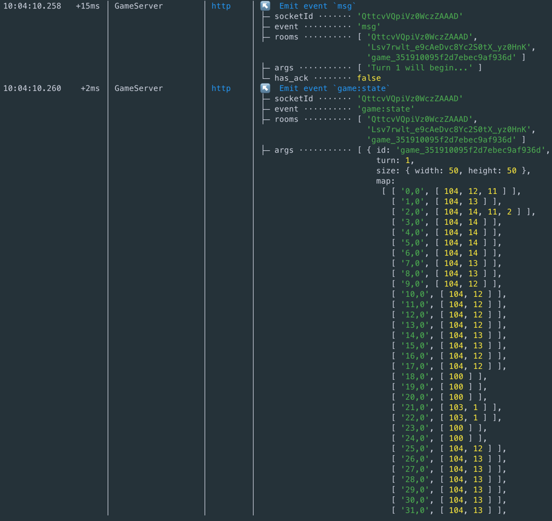

# Outbreak

Devs experiments to (pretend to) build a game using [Typescript](https://www.typescriptlang.org/), [Express](https://expressjs.com/), [Socket.IO](https://socket.io/), [React](https://react.dev) & [Three.js](https://threejs.org/).

Features
- Websocket server
- Procedural map generation
- Simulated environment:
  - Wind
  - Fire (propagated by wind)
  - Zombies basic IA

## Run it

Start the `/backend` (`npm run dev`) and use CLI commands:
```
exit ·················································· Send SIGINT signal
help [prefix] ········································· Show registered commands
? ...args ············································· Alias for help
server:start [port] ··································· Start server listening
server:stop ··········································· Stop server listening
server:status ········································· Display server status
game:create gameId ···································· Create a new game and go inside
game:list ············································· List in progress games
game:enter gameId ····································· Enter in CLI interaction mode with gameId
game:quit ············································· Leave CLI interaction mode
game:show ············································· Display map
game:turn ············································· Resolve turn
game:set:wind angle force ····························· Change wind settings
game:debug:at x y ····································· Get map debug infos at specified coords
game:debug:id id ······································ Get map debug infos for specified entity id
```

Start the front-end from `/app` (`npm run start`)




